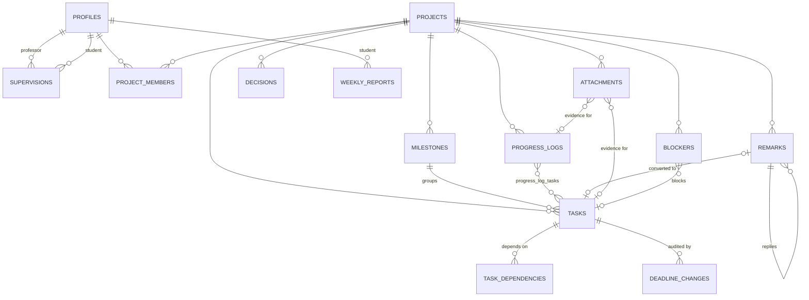

# ResearchFlow — Product & System Specification

> **Accountability through deadlines + proof-based progress.**
> A professor–student project system where every deadline has an owner, every claim of
> progress carries evidence, and nobody has to ask "what's the status?".

This document covers Phases 1–6 and 8. Phase 7 (implementation) lives in the code;
[§7](#phase-7--implementation-map) maps each step to its files.

---

## Phase 1 — Product Thinking

### 1.1 The core problem

Research supervision runs on an **unstructured loop**:

```
 Meeting (every 1–2 weeks)
   │  professor says "try X, and have the results by next week"
   ▼
 Verbal intent ──► nothing written down ──► student drifts ──► next meeting:
   ▲                                                         "so... where are we?"
   └──────────────────────── trust erodes ◄───────────────────────┘
```

The real failure is not laziness. **The loop between what the professor asks for and
what the student does has no artifact.** Three things are missing:

| Missing artifact | Consequence |
|---|---|
| A **deadline that someone owns** | Open-ended research expands to fill all available time (Parkinson's law). Students start late ("student syndrome"). |
| A **record of work as it happens** | Two weeks of real effort (failed experiments, debugging, reading) looks like "nothing" in a 15-minute meeting. |
| A **closed feedback loop** | Professor comments vanish into email, WhatsApp, and memory. Nobody can tell whether a remark was acted on. |

### 1.2 Target users

| Segment | Who | Primary need |
|---|---|---|
| **Primary: research students** | M.Tech/MS/PhD students, final-year UG project students, research interns | Structure, a clear next step, and a way to *show* their work |
| **Secondary: supervisors** | Professors/PIs supervising 3–15 students, ~10 minutes per student per week | A 30-second answer to "who is on track, who is stuck, what needs me?" |
| Future: lab staff | Postdocs and lab managers who co-supervise | Delegated review |

**Personas**

- **Riya (M.Tech, year 2):** two projects under one professor, meetings every other
  Friday. She works hard, but on Thursdays she panics because she can't summarise
  what she did. She keeps notes in three apps.
- **Prof. Mehta:** supervises 8 students and 3 funded projects. Gives feedback in
  meetings and by email, then forgets who was told what. Finds out a student is stuck
  three weeks too late.
- **Arjun (remote research intern):** works asynchronously across time zones. Has no
  visibility into whether his work is "enough", and no record to point to for a
  recommendation letter.

### 1.3 Key use cases (jobs to be done)

| # | When… | I want to… | So that… |
|---|---|---|---|
| S1 | I open the app in the morning | see the single most important next action | I don't waste the first hour deciding |
| S2 | I finish a work session | log what I did, what broke, what's next and how long it took, with proof | my effort is visible even when results aren't |
| S3 | my professor gives feedback | turn each remark into a tracked task | nothing gets forgotten |
| S4 | I'm stuck | raise a blocker that my professor sees | I don't lose a week silently |
| S5 | the week ends | get an auto-generated report I can send | I don't spend 2 hours writing a status email |
| S6 | I make a methodological choice | record the decision and why | the thesis chapter and the next student have the reasoning |
| P1 | I have 10 minutes before a meeting | see each student's progress, last activity, blockers and pending reviews | the meeting starts at the real issue |
| P2 | a student submits work | review the evidence and approve or request changes | quality is gated, not assumed |
| P3 | I set a deadline | know it can't be quietly moved | deadlines mean something |

### 1.4 Pain points

| Student | Professor |
|---|---|
| No deadlines, so no urgency | Can't see progress between meetings |
| Doesn't know what to do next | Feedback isn't tracked |
| Invisible effort (failed experiments count for nothing) | Learns about blockers late |
| Feedback scattered across channels | Status meetings waste time on recall |
| Writing status updates is painful | No history when writing recommendation letters or reviewing a thesis |
| No record for the thesis or a CV | Every student uses a different tool, or none |

### 1.5 Why not Notion, Trello, Jira, Asana or Google Classroom?

| | Notion / Trello / Asana | Jira | Google Classroom | **ResearchFlow** |
|---|---|---|---|---|
| Setup | Blank canvas; someone must design the system | Heavy, built for software teams | Built for courses, not research | **Opinionated schema, zero setup** |
| Roles | Symmetric: anyone can edit anything | Configurable, complex | Teacher/student, assignment-shaped | **Asymmetric: the professor owns deadlines and the approval gate** |
| Done means… | Someone ticked a box | A workflow transition | Submission | **Evidence attached + professor approval** |
| Daily progress | Not a concept | Worklogs (time only) | — | **Daily log: work, problems, next steps, time, proof** |
| Feedback | Comments that die in a thread | Comments | Private comments | **Remark → task, tracked until addressed** |
| Reporting | Manual | Dashboards for managers | Grades | **Auto-generated weekly report, shareable by link** |
| History | Editable forever | Audited | — | **Append-only: logs lock, deadline moves are recorded** |
| Adoption | Both sides must adopt | Org-wide rollout | Institution-wide | **Works single-player; the professor can join later or just read a link** |

The one-line difference: **generic tools store tasks. ResearchFlow enforces a contract
between two people with unequal roles.**

### 1.6 Core philosophy and product principles

**"Accountability through deadlines + proof-based progress."** Six principles follow
from it, and each is enforced in the database, not only in the UI:

1. **Deadlines have owners.** A professor deadline can only be moved by the professor,
   and every move is recorded.
2. **Progress claims carry proof.** A task cannot be submitted or closed without a log
   entry or an attachment linked to it.
3. **Done is a verdict, not a checkbox.** Professor-reviewed tasks close only when the
   professor approves.
4. **History is append-only.** Logs can't be backdated beyond a short grace window
   and lock after it. Submitted reports are frozen.
5. **The next action is never ambiguous.** One computed "Next Action" sits on top of
   every dashboard.
6. **The professor's time is the scarcest resource.** Their view answers "who needs
   me?" in one scan.

**Adoption insight:** the student feels the pain, but the professor holds the power.
If the product requires the professor to adopt it first, it dies. So ResearchFlow
**works single-player**: a student can create projects, record professor deadlines
and meeting remarks, and send a weekly report link. When the professor joins (by join
code), ownership of deadlines and approval moves to them automatically.

### 1.7 Success metrics

| Metric | Target (pilot lab, 8 weeks) |
|---|---|
| Students logging progress ≥ 4 days/week | ≥ 70% |
| Professor deadlines met on time | ≥ 80% |
| Median time from remark to task/response | < 48 h |
| Weekly reports submitted | ≥ 85% of student-weeks |
| Professor weekly active | ≥ 1 session/week |
| Median blocker age when resolved | < 3 days |

### 1.8 Non-goals

Not a reference manager (Zotero), a document editor (Overleaf), an LMS or gradebook, a
chat tool, or surveillance software (no screenshots, no keystroke tracking). Time
spent is self-reported, alongside evidence.

---

## Phase 2 — System Design

### 2.1 Entities

| Entity | Purpose | Key fields |
|---|---|---|
| **User** (`profiles`) | Person and role | `id`, `full_name`, `role` (student/professor), `join_code` (professors), `timezone` |
| **Supervision** | Professor↔student link, made via join code | `professor_id`, `student_id` |
| **Project** | Unit of research work | `title`, `description`, `status`, `start_date`, `target_end_date`, `created_by` |
| **Project member** | Who is on the project, in which role | `project_id`, `user_id`, `role` |
| **Milestone** | Professor-level checkpoint | `title`, `due_date`, `position` |
| **Task** | Unit of executable work | `status`, `priority`, `assignee_id`, `professor_deadline`, `personal_deadline`, `effective_deadline` (generated), `requires_review`, `source_remark_id` |
| **Task dependency** | "B can't be submitted until A is done" | `task_id`, `depends_on_id` (acyclic) |
| **Deadline change** | Audit of every deadline move | `task_id`, `field`, `old_value`, `new_value`, `changed_by` |
| **Progress log** | Daily, evidence-based work entry | `log_date`, `completed_work`, `problems`, `next_steps`, `minutes_spent`, linked tasks |
| **Remark** | Professor feedback, meeting notes, replies | `kind` (comment/change_request/question/approval), `source` (app/meeting), `parent_id`, `addressed_at`, `converted_task_id` |
| **Attachment** | File or link used as evidence | `kind` (file/link), `storage_path` or `url`, attached to a task, log or remark |
| **Blocker** | Something stopping progress | `severity`, `needs_professor`, `status`, `resolution` |
| **Decision** | Lightweight decision record | `title`, `context`, `decision`, `alternatives`, `decided_on` |
| **Weekly report** | Frozen weekly snapshot | `week_start`, `stats` (JSON), `highlights`, `student_note`, `submitted_at`, `acknowledged_at`, `share_token` |

### 2.2 Relationships



Design choices:

- **Membership with roles instead of a `professor_id` column.** A project can exist
  with only students (single-player mode) and gain a professor later. Every
  permission derives from `project_members.role`.
- **Two deadlines per task.** `professor_deadline` is the external commitment;
  `personal_deadline` is the student's own earlier target. `effective_deadline =
  least(personal, professor)` is a generated column, so every query sorts by the
  same thing.
- **Logs ↔ tasks is many-to-many.** One day's work often touches several tasks, and a
  log linked to a task counts as evidence for it.
- **Weekly reports are per student, not per project.** That matches how supervisors
  think: "how was Riya's week?"

### 2.3 The workflow

```
 PROFESSOR                       STUDENT                          SYSTEM
 ─────────                       ───────                          ──────
 Create project ───────────────► sees project
 Add milestone (due date)
 Create task + professor deadline ─► task in "To do"           effective deadline computed
                                 sets personal deadline (≤ professor's)
                                 starts → "In progress"
                                 logs progress daily ─────────► evidence accumulates
                                 raises blocker? ─────────────► professor's "Needs you" list
                                 submits for review ──────────► blocked unless evidence exists
                                                                and dependencies are done
 Reviews evidence
 ├─ Approve ──────────────────► task "Done"                     completed_at stamped
 └─ Request changes + remark ──► task "Changes requested"
                                 remark → converted to subtask
                                 revises, logs, resubmits ────► back to review
 Milestone complete when every task in it is done ─────────────► progress % updates
 End of week ◄────────────────── submits weekly report ◄──────── report auto-generated
 Acknowledges report
```

### 2.4 Task state machine

```
              start                 submit (needs evidence + deps done)
   ┌──────┐ ───────► ┌─────────────┐ ──────────────────────► ┌───────────┐
   │ todo │          │ in_progress │                         │ in_review │
   └──────┘ ◄─────── └─────────────┘ ◄──────┐                └─────┬─────┘
                            ▲               │ revise          approve │  request changes
                            │        ┌──────┴────────────┐           │  (professor only)
                            └────────│ changes_requested │◄──────────┤
                                     └───────────────────┘           ▼
                                                                ┌──────┐
     tasks without review: in_progress ── close (evidence) ───► │ done │
                                                                └──────┘
```

| Transition | Who | Guard |
|---|---|---|
| todo → in_progress | assignee / any member | — |
| in_progress → in_review | student | evidence exists; all dependencies done |
| in_review → done | **professor only** (if `requires_review`) | — |
| in_review → changes_requested | **professor only** | a remark is posted in the same transaction |
| in_progress → done | student, only if `requires_review = false` | evidence exists; dependencies done |
| any → todo | any member | — |

`requires_review` defaults to **true** when the project has a professor member, and
false otherwise.

### 2.5 Permission matrix

| Action | Student member | Professor member | Non-member |
|---|---|---|---|
| View project and everything in it | ✅ | ✅ | ❌ |
| Create / edit tasks and milestones | ✅ | ✅ | ❌ |
| Set or move **professor** deadline | ❌ once a professor is on the project (✅ before) | ✅ | ❌ |
| Set personal deadline | ✅ (clamped ≤ professor deadline) | ✅ | ❌ |
| Approve / request changes | ❌ | ✅ | ❌ |
| Write a progress log | ✅ own, dated today to 2 days ago | ✅ | ❌ |
| Edit a log | own, within 2 days of its date | ❌ | ❌ |
| Remark: comment | ✅ | ✅ | ❌ |
| Remark: change request / question | ✅ only as `source = meeting` | ✅ | ❌ |
| Remark: approval | ❌ | ✅ | ❌ |
| Delete an attachment | own, < 24 h old, and not evidence on a task under review or done | same | ❌ |
| Edit a weekly report | own, until submitted | acknowledge only | ❌ |
| View a supervised student's weekly report | ✅ own | ✅ | public only via share token, if enabled |

### 2.6 Enforcement lives in Postgres

Every rule above is implemented as a **Row-Level Security policy or trigger**, so it
holds for every client: the web UI, a script with the anon key, or a future mobile
app. The Next.js server actions validate input for good error messages, but they are
not the security boundary.

| Rule | Mechanism |
|---|---|
| Only members see project data | RLS `using (is_project_member(project_id))` |
| Professor deadline is professor-owned | `tasks_enforce_rules` trigger |
| Evidence before submit/close | `tasks_enforce_rules` trigger |
| Dependencies before submit/close | `tasks_enforce_rules` trigger |
| No dependency cycles | `task_dependencies_no_cycle` trigger (recursive CTE) |
| Deadline moves are audited | `tasks_audit_deadlines` trigger → `deadline_changes` |
| No backdating logs | RLS `with check (log_date between current_date - 2 and current_date + 1)` |
| Logs lock after the grace window | RLS update `using (log_date >= current_date - 2)` |
| Submitted reports are frozen | `weekly_reports_enforce` trigger |
| Atomic multi-row operations | `create_project`, `review_task`, `convert_remark_to_task`, `join_professor` RPCs |

### 2.7 Derived metrics (single definitions)

| Metric | Definition |
|---|---|
| Project progress % | done tasks ÷ all tasks (milestone-weighted when milestones exist: mean of milestone completion) |
| Overdue | `effective_deadline < now()` and status ≠ done |
| Missed professor deadline | `completed_at > professor_deadline`, or not done and `professor_deadline < now()` |
| On-time rate | tasks done on or before their effective deadline ÷ tasks done that had one |
| Last activity | max(latest log, latest task update, latest attachment) |
| Log consistency | distinct days with ≥ 1 log in the period ÷ days in the period |
| Stale student | no progress log for ≥ 3 days on an active project |
| Delay risk | see [§8.2](#82-predict-deadline-delays) (heuristic shipped in MVP) |

---

## Phase 3 — UI/UX Design

### 3.1 Design language

**Calm, dense, keyboard-first.** It borrows Linear's density and status semantics,
Notion's quiet typography, and Apple's restraint with color: color carries meaning,
never decoration.

| Token | Light | Dark | Use |
|---|---|---|---|
| `background` | `#FBFBFA` | `#0E0E10` | App canvas |
| `card` | `#FFFFFF` | `#16161A` | Surfaces |
| `border` | `#E7E6E3` | `#26262B` | 1px hairlines everywhere |
| `foreground` | `#1C1C1E` | `#EDEDEF` | Primary text |
| `muted-foreground` | `#6B6B70` | `#8E8E96` | Secondary text and meta |
| `primary` | `#4F46E5` (indigo) | `#6E66FA` | One accent: primary action, focus, current item |
| `danger` | `#DC2626` | `#F87171` | Overdue, missed professor deadline |
| `warning` | `#C26B05` | `#FBBF24` | Due within 48 h, blockers |
| `success` | `#15803D` | `#4ADE80` | Done, approved |
| `info` | `#2563EB` | `#60A5FA` | In review, awaiting professor |

- **Type:** Geist Sans for UI (13–14 px body, 600 weight for titles), Geist Mono for
  dates, counts and shortcut hints. Tabular numerals everywhere numbers align.
- **Spacing:** 4 px grid. Rows are 36–40 px. Cards have 12–16 px padding and 8 px
  radius.
- **Status glyphs:** these mirror Linear, so a status reads before its text does.
  ○ todo · ◐ in progress · ◉ in review · ⟲ changes requested · ● done.
- **Deadline chips** carry two flavors: a **Prof** chip (filled, can't be moved by the
  student) and a **Me** chip (outlined, personal target). Color shows urgency: grey,
  then amber under 48 h, then red when overdue.
- **Motion:** 120–150 ms opacity and transform only. `prefers-reduced-motion` is
  respected.

### 3.2 App shell

```
┌────────────┬───────────────────────────────────────────────────────────────┐
│ ◆ ResearchFlow │  Dashboard                         ⌘K Search…   ◐ theme  RG │
│            ├───────────────────────────────────────────────────────────────┤
│ ⌂ Dashboard│                                                               │
│ ▤ Projects │                         page content                          │
│ ✎ Log      │                                                               │
│ ▦ Calendar │                                                               │
│ ⎙ Reports  │                                                               │
│            │                                                               │
│ PROJECTS   │                                                               │
│ • GNN-Pruning                                                              │
│ • Survey   │                                                               │
│            │                                                               │
│ ⚙ Settings │                                                               │
└────────────┴───────────────────────────────────────────────────────────────┘
 Mobile (< 768 px): the sidebar becomes a 5-icon bottom tab bar, the header keeps
 the title and ⌘K, and the "+" log action floats bottom-right.
```

**Keyboard map** (shown with `?`):

| Keys | Action |
|---|---|
| `⌘K` / `Ctrl K` | Command palette: jump to any project, task or page, or run an action |
| `g d` / `g p` / `g l` / `g c` / `g r` | Go to Dashboard / Projects / Log / Calendar / Reports |
| `n` | New progress log |
| `?` | Shortcut help |
| `Esc` | Close dialog / palette |

### 3.3 Screen 1 — Student dashboard

The page answers three questions in this order: **what do I do now, what's late, and
what does my professor want.**

```
┌───────────────────────────────────────────────────────────────────────────┐
│ Good morning, Riya                              Fri 3 Oct · Week 40      │
│ ┌─ NEXT ACTION ─────────────────────────────────────────────────────────┐ │
│ │ ⟲  Address professor's change request on "Ablation study"            │ │
│ │    Prof. Mehta · 2 days ago · GNN-Pruning      [Open task →]  (Enter) │ │
│ └───────────────────────────────────────────────────────────────────────┘ │
│ ┌ Overdue (2) ─────────────────┐ ┌ Today (3) ───────────────────────────┐ │
│ │ ● Run baseline   Prof −2d    │ │ ◐ Write related work   Me today      │ │
│ │ ○ Fix data split Me −1d      │ │ ○ Plot loss curves     Prof today    │ │
│ └──────────────────────────────┘ └──────────────────────────────────────┘ │
│ ┌ Professor feedback (1 open) ─────────────────────────────────────────┐ │
│ │ "Ablation must include the random-pruning baseline" → Convert to task │ │
│ └───────────────────────────────────────────────────────────────────────┘ │
│ ┌ Upcoming (7 days) ───────────┐ ┌ Projects ───────────────────────────┐ │
│ │ Mon  Milestone: Prelim results│ │ GNN-Pruning ███████░░░ 68%  2 risk │ │
│ │ Wed  ○ Submit draft  Prof    │ │ Survey      ███░░░░░░░ 31%         │ │
│ └──────────────────────────────┘ └──────────────────────────────────────┘ │
│ Logged today? ○ Not yet — [Write today's log] (n)    This week: 14h · 4/5d│
└───────────────────────────────────────────────────────────────────────────┘
```

- The **Next Action** comes from a deterministic priority ladder ([§4.9](#49-next-action-engine)).
  It has a single CTA, and `Enter` opens it.
- **Empty state:** "No projects yet. Create one, or link your professor with their
  join code."
- **Logging nudge:** a persistent bottom strip until today's log exists.

### 3.4 Screen 2 — Project page

The header is a title, status, members, a progress bar and the next professor
deadline. The tabs are separate routes, so each one is bookmarkable and works with the
back button:

`Overview · Tasks · Timeline · Logs · Remarks · Files · Blockers · Decisions`

```
GNN-Pruning  ● Active   RG  PM        ███████░░░ 68%    Next Prof deadline: Mon 6 Oct
──────────────────────────────────────────────────────────────────────────────────
Overview | Tasks | Timeline | Logs | Remarks | Files | Blockers | Decisions

 Tasks   [Board | List]   + New task (c)
 ┌ To do (3) ─────┐┌ In progress (2) ┐┌ In review (1) ┐┌ Changes (1) ┐┌ Done (8) ┐
 │ Fix data split │ │ Write rel. work │ │ Baseline run  │ │ Ablation    │ │ …        │
 │ Prof Mon · ⛓1  │ │ Me today · 📎2  │ │ awaiting Prof │ │ ⟲ 1 remark  │ │          │
 └────────────────┘└─────────────────┘└───────────────┘└─────────────┘└──────────┘
```

- **Overview:** milestone cards (progress, due date), open blockers, the latest 3 logs,
  open remarks and recent decisions.
- **Board:** drag cards between columns. Illegal moves (for example a student dropping
  onto Done on a reviewed task) snap back with the server's reason in a toast. Every
  card also has a status menu for keyboard users.
- **List:** a sortable table grouped by milestone, with status, assignee, both
  deadlines, priority and evidence count.
- **Timeline:** a Gantt strip per milestone from project start to target end, with a
  "today" line. Task deadlines are drawn as ◆ markers, red when overdue.
- **Logs / Remarks / Files / Blockers / Decisions:** project-scoped versions of the
  global screens below.

### 3.5 Screen 3 — Task page

```
GNN-Pruning › Prelim results ›  Run ablation study                     ◉ In review
───────────────────────────────────────────────────────────────────────────────────
Description (markdown-lite)                       │ Status    [◉ In review ▾]
                                                  │ Assignee  Riya G.
Evidence (3)                                      │ Priority  High
 📝 Log · 2 Oct · "ran 4 configs…"   2h 30m       │ Prof deadline  Mon 6 Oct 🔒
 📎 ablation_table.pdf  212 KB                    │ My deadline    Sat 4 Oct
 🔗 github.com/…/commit/a1b2c3                    │ Milestone  Prelim results
                                                  │ Depends on  ● Run baseline
Remarks                                           │ Blocking   ○ Write results §
 PM  "Include random-pruning baseline" ⟲          │
     → converted to "Add random baseline"         │ Deadline history
 RG  "Added, see table v2"                        │  Prof: 29 Sep → 6 Oct (PM)
 [ write a remark…                    ] [Send]    │
                                                  │ ┌ Professor actions ──────┐
                                                  │ │ [Approve] [Request changes]│
                                                  │ └─────────────────────────┘
```

- The 🔒 on the professor deadline means read-only for students once a professor is
  on the project.
- **Submit for review** is disabled until there's evidence and dependencies are done.
  The button explains why ("Add a log or file as evidence first").
- **Deadline history** makes slips visible without blame.

### 3.6 Screen 4 — Progress log (critical)

This is designed to take **under 90 seconds** and run every working day.

```
 Progress log                                           [Project ▾ GNN-Pruning]
 ┌ Today · Fri 3 Oct ──────────────────────────────────────────────────────────┐
 │ What did you complete?  ▸ Ran 4 ablation configs; table v2 drafted         │
 │ Problems / what failed  ▸ OOM on config 4 at batch 128                     │
 │ Next steps              ▸ Retry with grad checkpointing                    │
 │ Time spent  [2h 30m]  (quick: 30m 1h 2h 4h)   Tasks: [Ablation ×] [+]      │
 │ Evidence  [📎 Upload] [🔗 Add link]                          [Save log ⌘↵] │
 └─────────────────────────────────────────────────────────────────────────────┘
 ── Thu 2 Oct ────────────────────────────── 3h 10m · 2 tasks · 📎1 ──────────
   ✓ Baseline reproduced (acc 91.2)   ✗ Seeds unstable   → Fix seeds
 ── Wed 1 Oct ────────────────────────────── written 1 day late ⓘ ──────────
```

- **Three prompts, not a blank page.** Completed / Problems / Next steps is the
  smallest structure that makes a log useful to the professor. Only "completed" is
  required.
- **Problems are first-class**, because failed experiments are real work.
- **A day you wrote late is marked** "written N days late". It's honest without being
  punitive. Logs older than the grace window are read-only.
- **A heatmap** (last 12 weeks) sits at the top of the global log page.

### 3.7 Screen 5 — Professor view

```
 Students (8)            Needs you: 3 reviews · 2 blockers · 1 stale    Code: K7Q2-MX4P
 ┌──────────────┬──────────────┬──────────┬────────────┬─────────┬────────┬────────┐
 │ Student      │ Project      │ Progress │ Last update│ Overdue │Blockers│ Review │
 ├──────────────┼──────────────┼──────────┼────────────┼─────────┼────────┼────────┤
 │ Riya G.      │ GNN-Pruning  │ ███▌ 68% │ 2h ago     │ 0       │ –      │ 1 ◉    │
 │ Arjun S.  ⚠  │ Survey       │ █▌   31% │ 4d ago ⚠   │ 2       │ 1 high │ –      │
 └──────────────┴──────────────┴──────────┴────────────┴─────────┴────────┴────────┘
 ┌ Pending reviews ─────────────────┐ ┌ Open blockers ──────────────────────────┐
 │ ◉ Baseline run · Riya · 1d       │ │ ▲ GPU quota exhausted · Arjun · 3d      │
 └──────────────────────────────────┘ └──────────────────────────────────────────┘
 ┌ Weekly reports awaiting acknowledgement (2) ──────────────────────────────────┐
```

- A **row per student × project**, sorted by "needs attention" (stale, overdue,
  blockers, reviews), not alphabetically.
- Clicking a student opens their drill-down: projects, a log heatmap, recent logs and
  reports.

### 3.8 Screen 6 — Weekly report

```
 Week 40 · 29 Sep – 5 Oct · Riya G.                   [Draft]  [Submit report]
 ┌ Summary (auto) ─────────────────────────────────────────────────────────────┐
 │ Completed 4 tasks (3 on time) · 14h 20m over 5 days · 1 blocker resolved    │
 │ ⚠ 1 professor deadline missed: "Run baseline" (2 days late)                 │
 └─────────────────────────────────────────────────────────────────────────────┘
 Completed · In progress · Missed/overdue · Blockers · Decisions · Next week's deadlines
 Highlights from logs (auto-extracted "completed" lines)
 Your note to professor  [ textarea ]
 Share: [ ] Anyone with the link can view   🔗 copy link
```

- **Generated on open** from the week's data and re-generated until submitted. On
  submit, the stats are frozen as a snapshot.
- The **share link** (`/r/<token>`) is for professors who haven't joined. It's off by
  default and revocable.

### 3.9 Screen 7 — Calendar

A month grid (week starts Monday). Each day lists task deadlines (Prof chip filled, Me
chip outlined) and milestones (◆). Overdue items are red, and days with a log get a
small dot, so the calendar doubles as a consistency view. Arrow buttons and `←`/`→`
change month, and `t` jumps to today. On mobile it collapses to an agenda list.

### 3.10 Cross-cutting states

| State | Treatment |
|---|---|
| Loading | Route-level skeletons (`loading.tsx`) shaped like the content |
| Empty | One sentence on what this is, plus the single action that fills it |
| Error | Inline message with the server's reason. Rule violations from the database are shown verbatim, because they're written for humans. |
| Permission | Controls the user can't use are hidden, not shown disabled. Locked fields show 🔒 with a tooltip. |
| Optimistic UI | Board moves and status changes apply instantly and roll back on failure |

---

## Phase 4 — Feature Breakdown

### 4.1 Deadline system

- **Two deadlines per task:** professor (hard) and personal (soft, self-imposed).
  Milestones carry a professor due date.
- **Clamping:** if the professor moves their deadline earlier than the personal one,
  the personal deadline is clamped to match. A personal deadline later than the
  professor's is rejected.
- **Ownership:** once a professor is on a project, only they can change a professor
  deadline.
- **Audit:** every change of either deadline writes a `deadline_changes` row. The task
  page shows the history, and analytics count "slips" (moves later).
- **Urgency bands:** overdue (red), < 48 h (amber), this week (default), later (muted).

### 4.2 Progress tracking

- One log per student per project per day, editable within the grace window (date
  between today − 2 and today).
- Fields: completed work (required), problems, next steps, minutes spent (0–1440),
  linked tasks, and attachments.
- A log linked to a task counts as **evidence** for that task.
- A late-written marker appears when `created_at` falls after `log_date`.
- Consistency heatmap, and weekly hours.

### 4.3 Professor feedback system

- **Remarks** attach to a project and optionally a task. Kinds: `comment`,
  `change_request`, `question`, `approval`. Replies go one level deep.
- **"Needs response"** means a professor-authored (or meeting-sourced) change request
  or question that isn't addressed.
- **Convert to task** (one click): creates a task prefilled from the remark, linked
  through `source_remark_id`, inherits the remark's task milestone, and marks the
  remark addressed. This is atomic, via RPC.
- **Meeting remarks:** a student can record "Prof said in our meeting…" as
  `source = meeting`. That's single-player mode, and it's labelled honestly.
- **Request changes** on a task creates the remark and flips the status in one
  transaction.

### 4.4 Blocker tracking

- Raise from a project or task, with severity (low/medium/high) and a "needs professor"
  flag.
- Open blockers show on the task card (⛔), the project overview, the student
  dashboard and the professor's "Needs you".
- Resolving requires a resolution note, which becomes searchable knowledge. Age is
  displayed.

### 4.5 Decision log

- A lightweight record: title, context, decision, alternatives considered, date.
- Optionally marked superseded by a later decision.
- Purpose: thesis writing, onboarding the next student, and settling "why did we do it
  this way?"

### 4.6 Weekly report generator

- A pure function `buildWeeklyReport(data, weekStart)` that is deterministic and
  unit-tested.
- Contents: tasks completed (on-time vs late), tasks in progress, missed and overdue
  professor deadlines, total time and active days, blockers opened/resolved/open,
  decisions made, remarks received, deadlines next week, and highlights pulled from
  the logs.
- Lifecycle: Draft (regenerated on view), then Submitted (frozen snapshot), then
  Acknowledged by the professor. It can optionally be shared by link.

### 4.7 Task dependencies

- `task_dependencies(task_id, depends_on_id)` within the same project. Cycles are
  rejected by a trigger.
- A task can't be submitted or closed while a dependency isn't done.
- UI: "Waiting on …" chips on the card and task page, and a "Blocking …" list.

### 4.8 Analytics (basic)

- Hours per week (last 8 weeks), on-time rate, log consistency (12-week heatmap),
  deadline slips, average review turnaround and open blocker age.
- **Delay risk per open task** (heuristic): a high, medium or low label with reasons.
  See §8.2.

### 4.9 Next-action engine

A deterministic, explainable priority ladder. The first rule that matches wins:

1. Professor remark needing response (oldest first)
2. Task with **changes requested**
3. **Overdue** task (professor deadline first, then most overdue)
4. Open **blocker you raised** with severity high: "follow up"
5. Task due **within 48 h** (in progress before to-do)
6. **In-progress** task with the nearest deadline
7. Unblocked **to-do** task (dependencies done), by deadline then priority
8. Fallback: "Write today's progress log", or "Plan your next task"

The reason is always displayed ("because it's 2 days overdue on a professor
deadline"), so the user trusts the recommendation.

For professors the ladder is: pending review → high blocker needing professor → stale
student → unacknowledged report.

---

## Phase 5 — MVP Plan

### 5.1 In scope (built)

| Area | MVP scope |
|---|---|
| Auth | Email/password signup with a role choice, email confirmation route, session refresh in `proxy.ts`, server-side guard on every page |
| Supervision | Professor join code; student links with the code |
| Projects | Create (atomic RPC with members), list with progress, status, add a supervised member |
| Milestones | Create/edit/delete, due date, derived completion |
| Tasks | Create/edit, board + list, status transitions with DB guards, both deadlines, dependencies, deadline history |
| Progress log | Daily entry form, linked tasks, grace window, late marker, heatmap |
| Remarks | Comment, change request, question, approval, replies, convert to task, addressed state |
| Review | Submit for review, approve, request changes (atomic) |
| Blockers & decisions | Create, resolve / supersede |
| Files | Direct-to-storage upload, links, signed download, evidence linking |
| Dashboards | Student (next action, overdue, today, upcoming, feedback, projects) and professor (needs-you, student table) |
| Calendar | Month grid of deadlines and milestones |
| Weekly report | Generate, note, submit, acknowledge, share link |
| Analytics | Basic stats and delay-risk heuristic |
| UX | Dark/light/system, ⌘K palette, `g`-shortcuts, responsive shell |

### 5.2 Out of scope (next)

Email and push reminders (cron), notifications inbox, realtime updates, multiple
professors per student with per-project report scoping, institution SSO, an Overleaf
or GitHub integration that pulls commits as evidence, mobile app, and the AI layer
beyond remark splitting.

### 5.3 Build order (the cut line is after step 8)

```
1 setup ─► 2 schema+RLS ─► 3 auth ─► 4 shell+dashboard ─► 5 projects ─► 6 tasks
  ─► 7 progress log ─► 8 remarks+review  ═══ usable MVP ═══
  ─► 9 files ─► 10 weekly report ─► calendar/analytics ─► AI
```

### 5.4 Acceptance criteria

- A student can't move a professor's deadline, close a reviewed task, or submit
  without evidence, **even by calling the database API directly**.
- A professor sees every supervised student's status on one screen, sorted by need.
- Logging a day takes one form and under 90 seconds.
- A weekly report needs zero writing to be useful. The note is optional.
- Every page works at 375 px wide and in both themes.

---

## Phase 6 — Tech Stack & Architecture

### 6.1 Stack

| Layer | Choice | Why |
|---|---|---|
| Framework | **Next.js 16** (App Router, React 19.2, Turbopack) | Server Components read data next to the UI. Server Actions handle mutations without a hand-written API layer. |
| Language | TypeScript (strict) | One type set from DB rows to components |
| Styling | **Tailwind CSS v4** + CSS-variable tokens | Theme tokens in one file; dark mode by class |
| Components | **shadcn/ui** (Radix primitives, owned in `src/components/ui`) | Accessible primitives (dialog, menu, select, tooltip) without a locked-in library |
| Backend | **Supabase**: Postgres, Auth, Storage | Gives auth, file storage and a Postgres with RLS in one managed service, so security lives in the database |
| Database | **PostgreSQL 15+** | Relational data, triggers, generated columns, RLS, recursive CTEs |
| Validation | Zod | Server action input parsing and form errors |
| Dates | date-fns | Tree-shakeable, immutable |
| Icons | lucide-react | Consistent stroke icons |
| Theming | next-themes | System/light/dark without flash |
| Tests | `node:test` (built in) for domain logic; PGlite for SQL/RLS | No test framework dependency; the SQL is tested against real Postgres |
| AI (Phase 8) | Claude API (`@anthropic-ai/sdk`) | Structured extraction from remarks, report narratives |
| Hosting | Vercel (web) + Supabase (data) | Zero-ops, free tiers suffice for a lab |

**Why not Express?** It would add a server to deploy and an API layer to secure twice.
With RLS, the database is the authorization layer, and Server Actions are thin,
validated callers.

### 6.2 Architecture

```
 Browser
  │  RSC payloads / Server Action POSTs            direct upload (signed by RLS)
  ▼                                                       │
 Next.js 16 on Vercel                                     │
  ├─ src/proxy.ts            refresh Supabase session cookie; redirect anon users
  ├─ app/(app)/**/page.tsx   Server Components → lib/data/* (reads, RLS-scoped)
  ├─ server/actions/*.ts     'use server' → zod → Supabase (writes) → revalidatePath
  ├─ app/api/files/[id]      access-checked redirect to a short-lived signed URL
  └─ lib/domain/*            pure logic: deadlines, next action, risk, weekly report
  │
  ▼  supabase-js with the user's JWT (never the service key at request time)
 Supabase
  ├─ Auth (JWT)  ──► auth.uid() inside every policy
  ├─ Postgres    tables · RLS policies · triggers · RPCs (security definer, with search_path pinned)
  └─ Storage     bucket "attachments", path {project_id}/{uuid}-{name}, policies reuse is_project_member()
```

**Data flow rules**

1. **Reads** happen in Server Components through `lib/data/*`, using the request-scoped
   Supabase client. RLS decides visibility, and there is no "admin" read path.
2. **Writes** go through Server Actions in `server/actions/*`. Each one calls
   `requireUser()`, parses input with Zod, performs the write, translates Postgres
   errors into human messages, and revalidates the affected paths.
3. **Business rules** that must hold are enforced in SQL. Rules that are only
   presentation (urgency colors, next action, risk) live in `lib/domain` as pure,
   unit-tested functions.
4. **Files** never pass through the Next.js server (Server Actions are capped at
   1 MB). The browser uploads straight to Storage, then a Server Action records
   metadata.

### 6.3 Repository layout

```
researchflow/
├─ docs/PRODUCT_SPEC.md          this document
├─ supabase/
│  ├─ migrations/                schema, RLS, functions/triggers, storage
│  └─ tests/rls.test.mjs         runs the migrations in PGlite and tests rules as each role
├─ scripts/seed.mjs              demo professor, students, projects (service key, local only)
└─ src/
   ├─ proxy.ts                   session refresh + auth redirect
   ├─ app/
   │  ├─ (auth)/login, signup    public auth pages
   │  ├─ auth/confirm, signout   route handlers
   │  ├─ (app)/                  authenticated shell
   │  │  ├─ dashboard            role-aware
   │  │  ├─ projects/[projectId]/{tasks,timeline,logs,remarks,files,blockers,decisions}
   │  │  ├─ tasks/[taskId]
   │  │  ├─ log, calendar, reports, students/[studentId], settings
   │  ├─ r/[token]               public shared weekly report
   │  └─ api/files/[id]          signed download redirect
   ├─ components/{ui,layout,dashboard,projects,tasks,logs,remarks,reports,…}
   ├─ lib/
   │  ├─ supabase/{server,client,proxy}.ts
   │  ├─ data/                   server-only queries
   │  ├─ domain/                 pure logic + *.test.ts
   │  └─ ai/                     Phase 8
   ├─ server/actions/            mutations
   └─ types/database.ts          DB types (regenerate with `npm run db:types`)
```

### 6.4 Security model

- **RLS on every table.** Security-definer helpers (`is_project_member`,
  `is_project_professor`, `project_has_professor`) pin `search_path`, which avoids
  policy recursion and search-path hijacking.
- The **service role key** is used only by `scripts/seed.mjs`, never by the running
  app.
- **Storage policies** derive project access from the first path segment, so a member
  of project A can't read B's files even with a guessed path.
- **Shared report links** go through a security-definer RPC that returns only that
  report, and only if sharing is on.
- **Every Server Action re-checks auth.** Proxy coverage is a convenience, not the
  boundary (per the Next.js 16 data-security guidance).

---

## Phase 7 — Implementation map

| Step | What | Where |
|---|---|---|
| 1 | Project setup | `package.json`, `next.config.ts`, `src/app/globals.css`, `components.json` |
| 2 | Database schema, RLS, triggers, RPCs | `supabase/migrations/*.sql`, tested by `supabase/tests/rls.test.mjs` |
| 3 | Authentication | `src/proxy.ts`, `src/lib/supabase/*`, `src/app/(auth)/*`, `src/app/auth/*`, `src/server/actions/auth.ts` |
| 4 | Dashboard UI | `src/app/(app)/dashboard`, `src/components/dashboard/*`, `src/lib/domain/next-action.ts` |
| 5 | Project module | `src/app/(app)/projects/**`, `src/server/actions/projects.ts`, `milestones.ts` |
| 6 | Task module | `src/app/(app)/tasks/[taskId]`, `src/components/tasks/*`, `src/server/actions/tasks.ts` |
| 7 | Progress log | `src/app/(app)/log`, `src/components/logs/*`, `src/server/actions/logs.ts` |
| 8 | Remarks & review | `src/components/remarks/*`, `src/server/actions/remarks.ts` |
| 9 | File upload | `src/components/files/*`, `src/server/actions/attachments.ts`, `src/app/api/files/[id]` |
| 10 | Weekly report | `src/lib/domain/weekly-report.ts`, `src/app/(app)/reports/*`, `src/app/r/[token]` |
| + | Calendar, analytics, blockers, decisions | `src/app/(app)/calendar`, `src/lib/domain/risk.ts`, project tabs |

Setup and run instructions are in the [README](../README.md).

---

## Phase 8 — AI Enhancements (after MVP)

**Principles:** AI proposes and humans dispose. Every AI output lands as a draft the
user confirms. Nothing is auto-assigned, auto-approved or auto-sent. Deterministic
baselines ship first, and an LLM is added only where language understanding is the
bottleneck.

### 8.1 Convert professor comments → tasks *(implemented)*

- **Problem:** one remark often contains three asks ("rerun with 5 seeds, add the
  random baseline, and fix figure 3's axis").
- **Flow:** on the remark, the student clicks "Split into tasks (AI)". Claude returns
  structured `{tasks: [{title, description, priority, suggested_due_in_days}]}`. The
  student edits and accepts some or all, and each accepted task is created through
  `convert_remark_to_task` semantics.
- **Guardrails:** JSON-schema-constrained output; titles ≤ 120 chars; max 6 tasks; the
  remark text is passed as data, not instructions. If no API key is configured, the
  button is hidden and manual conversion still works.
- **Code:** `src/lib/ai/remark-to-tasks.ts`, `src/server/actions/ai.ts`.

### 8.2 Predict deadline delays

- **v1 (shipped, heuristic, `lib/domain/risk.ts`):** a score from time remaining vs
  estimate, status (still todo with < 25% of the window left), undone dependencies,
  open blockers, no progress logged on the task, and the student's historical slip
  rate. The output is a label plus reasons ("No progress logged · 1 open blocker ·
  due in 1 day").
- **v2 (data-driven):** once around 500 completed tasks exist, fit a logistic
  regression on the same features plus log velocity, and calibrate per student. It
  stays explainable, because coefficients map back to reasons.
- **v3 (LLM-assisted):** read the last 5 logs' "problems" text to detect stuck
  patterns ("same OOM error three days running") that structured features miss.

### 8.3 Suggest next actions

- **v1 (shipped):** the deterministic ladder in §4.9.
- **v2:** an LLM re-ranks the top 5 ladder candidates using the latest logs'
  "next steps" and professor remarks, and writes a one-sentence rationale. The ladder
  still guarantees that overdue and changes-requested work never drops below rank 3.

### 8.4 Analyze productivity patterns

- Weekly job over logs: time-of-week heatmap, session length vs completion, how long
  tasks wait between "in progress" and the first log, and the share of "problems"
  text that repeats.
- Output: 2–3 observations with evidence links, phrased as observations, not
  judgments ("Your Monday logs are 40% shorter; 3 of 4 missed deadlines followed a
  weekend with no logs").
- Privacy: the student sees their own patterns first and opts in before sharing them
  with the professor.

### 8.5 Generate weekly reports automatically

- **Shipped:** deterministic stats and highlights.
- **Next:** Claude writes a 4–6 sentence narrative from the frozen stats JSON and the
  week's log text. It is grounded (every claim must cite a log date or task), shown as
  an editable draft, and never submitted without the student's click.
- Cron (Vercel Cron, Friday 17:00 in the student's timezone): pre-generate drafts and
  email the student "your report is ready to review".

### 8.6 AI architecture

```
 server/actions/ai.ts ──► lib/ai/<feature>.ts ──► Claude API (structured output)
        │                        │
        │                        └─ prompt = system rules + data in delimited blocks
        └─ zod-validate model output ─► return draft to UI ─► user confirms ─► normal write path
```

- AI never writes to the database directly. Its output re-enters through the same
  validated actions and RLS as human input.
- Each feature is behind its own env flag. Cost per student-week is estimated at
  well under $0.01 at current small-model prices.
- Evaluation: a golden set of 50 real (anonymized) remarks with expected task splits,
  run before any prompt or model change.
